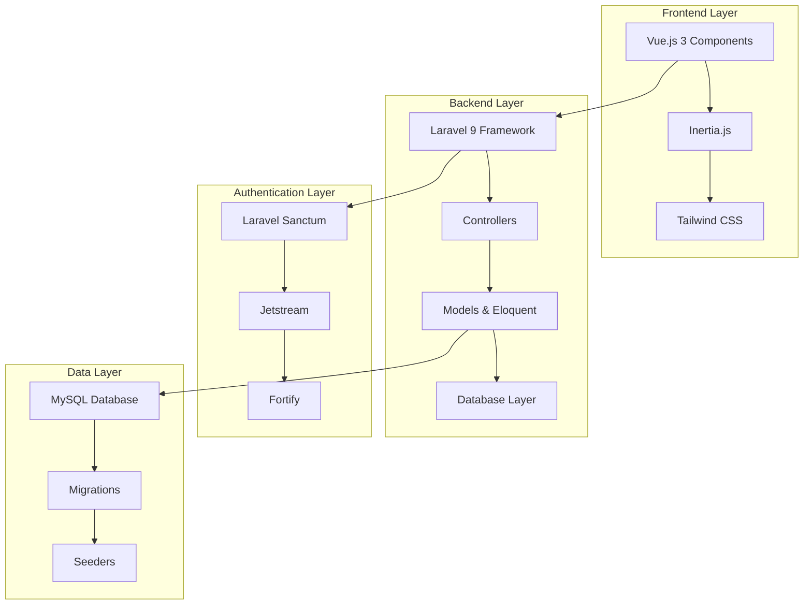
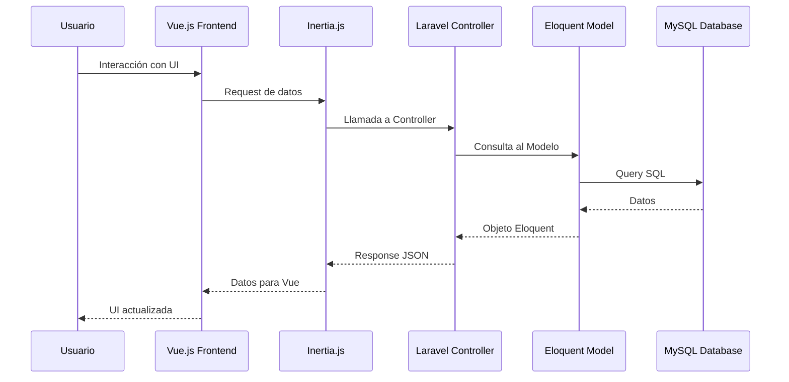
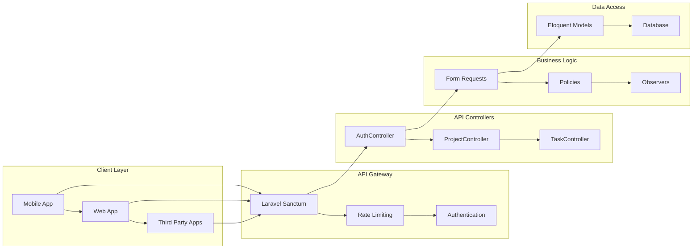
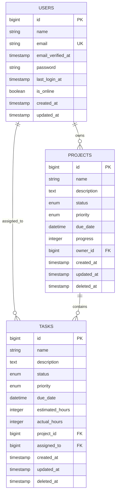

# TaskFlow - Sistema de Gestión de Proyectos y Tareas

## 📋 Descripción del Proyecto

TaskFlow es una aplicación web moderna desarrollada con Laravel 9 y Vue.js 3 que permite gestionar proyectos y tareas de manera eficiente. La aplicación incluye autenticación completa, dashboard interactivo, API REST y una interfaz de usuario moderna construida con Inertia.js y Tailwind CSS.

## 🚀 Características Principales

### 🔐 Autenticación y Autorización
- **Laravel Jetstream** con autenticación de dos factores
- **Laravel Sanctum** para autenticación API
- **Laravel Fortify** para funcionalidades de autenticación
- Registro, login, verificación de email y recuperación de contraseña
- Gestión de sesiones y tokens API

### 📊 Gestión de Proyectos
- Crear, editar y eliminar proyectos
- Estados: Planning, Active, Paused, Completed, Cancelled
- Prioridades: Low, Medium, High, Urgent
- Fechas de vencimiento y seguimiento de progreso
- Asignación de propietarios de proyectos

### ✅ Gestión de Tareas
- Crear, editar y eliminar tareas
- Estados: Pending, In Progress, Completed, Cancelled
- Prioridades: Low, Medium, High, Urgent
- Estimación y registro de horas reales
- Asignación de tareas a usuarios específicos
- Vinculación con proyectos

### 📈 Dashboard Interactivo
- Vista general de proyectos y tareas
- Estadísticas en tiempo real
- Filtros avanzados y búsqueda
- Estado de conexión del usuario
- Interfaz responsive con Tailwind CSS

### 🔌 API REST Completa
- Endpoints para proyectos y tareas
- Autenticación con tokens
- Filtros, paginación y ordenamiento
- Validación de datos con Form Requests
- Recursos API estructurados

## 🛠️ Stack Tecnológico

### Backend
- **Laravel 9** - Framework PHP
- **PHP 8.0+** - Lenguaje de programación
- **MySQL** - Base de datos
- **Laravel Sanctum** - Autenticación API
- **Laravel Jetstream** - Autenticación y scaffolding
- **Laravel Fortify** - Funcionalidades de autenticación

### Frontend
- **Vue.js 3** - Framework JavaScript
- **Inertia.js** - SPA sin API
- **Tailwind CSS** - Framework CSS
- **Vite** - Build tool
- **Axios** - Cliente HTTP

### Herramientas de Desarrollo
- **Laravel Pint** - Code formatter
- **PHPUnit** - Testing framework
- **Laravel Sail** - Docker development environment (Recomendado)
- **Faker** - Data generation for testing
- **Docker** - Containerización para desarrollo

## 📁 Estructura del Proyecto

```
laravel/
├── app/
│   ├── Actions/           # Acciones de Jetstream/Fortify
│   ├── Console/           # Comandos Artisan
│   ├── Exceptions/        # Manejo de excepciones
│   ├── Http/
│   │   ├── Controllers/   # Controladores web y API
│   │   ├── Middleware/    # Middleware personalizado
│   │   ├── Requests/      # Form Requests para validación
│   │   └── Resources/     # API Resources
│   ├── Models/           # Modelos Eloquent
│   ├── Observers/        # Model Observers
│   ├── Policies/         # Authorization Policies
│   └── Providers/        # Service Providers
├── database/
│   ├── factories/        # Model Factories
│   ├── migrations/       # Migraciones de base de datos
│   └── seeders/         # Database Seeders
├── resources/
│   ├── js/
│   │   ├── Components/   # Componentes Vue.js
│   │   ├── Layouts/      # Layouts de aplicación
│   │   └── Pages/        # Páginas de Inertia.js
│   └── css/             # Estilos CSS
├── routes/
│   ├── api.php          # Rutas API
│   └── web.php          # Rutas web
└── tests/              # Tests automatizados
```

## 🗄️ Modelo de Datos

### Usuarios (Users)
- Información básica del usuario
- Autenticación y autorización
- Relación con proyectos y tareas
- Seguimiento de último login

### Proyectos (Projects)
- Nombre, descripción y estado
- Prioridad y fecha de vencimiento
- Progreso calculado automáticamente
- Propietario del proyecto
- Soft deletes habilitado

### Tareas (Tasks)
- Nombre, descripción y estado
- Prioridad y fecha de vencimiento
- Estimación y horas reales
- Vinculación con proyecto
- Asignación a usuario específico
- Soft deletes habilitado

## 🔧 Instalación y Configuración

### Opción 1: Instalación Tradicional

#### Requisitos Previos
- PHP 8.0 o superior
- Composer
- Node.js y npm
- MySQL
- Git

#### Pasos de Instalación

1. **Clonar el repositorio**
```bash
git clone <repository-url>
cd laravel
```

2. **Instalar dependencias PHP**
```bash
composer install
```

3. **Instalar dependencias JavaScript**
```bash
npm install
```

4. **Configurar variables de entorno**
```bash
cp .env.example .env
php artisan key:generate
```

5. **Configurar base de datos en `.env`**
```env
DB_CONNECTION=mysql
DB_HOST=127.0.0.1
DB_PORT=3306
DB_DATABASE=taskflow
DB_USERNAME=root
DB_PASSWORD=
```

6. **Ejecutar migraciones**
```bash
php artisan migrate
```

7. **Ejecutar seeders (opcional)**
```bash
php artisan db:seed
```

8. **Compilar assets**
```bash
npm run dev
# o para producción
npm run build
```

9. **Iniciar servidor de desarrollo**
```bash
php artisan serve
```

### Opción 2: Instalación con Laravel Sail (Recomendado)

Laravel Sail proporciona un entorno de desarrollo Docker ligero para Laravel. Es la forma más fácil de comenzar a desarrollar con Laravel.

#### Requisitos Previos
- Docker Desktop
- Git

#### Pasos de Instalación con Sail

1. **Clonar el repositorio**
```bash
git clone <repository-url>
cd laravel
```

2. **Instalar dependencias PHP**
```bash
composer install
```

3. **Configurar variables de entorno**
```bash
cp .env.example .env
```

4. **Configurar Laravel Sail**
```bash
php artisan sail:install
```

5. **Iniciar los contenedores Docker**
```bash
./vendor/bin/sail up -d
```

6. **Generar clave de aplicación**
```bash
./vendor/bin/sail artisan key:generate
```

7. **Ejecutar migraciones**
```bash
./vendor/bin/sail artisan migrate
```

8. **Ejecutar seeders (opcional)**
```bash
./vendor/bin/sail artisan db:seed
```

9. **Instalar dependencias JavaScript**
```bash
./vendor/bin/sail npm install
```

10. **Compilar assets**
```bash
./vendor/bin/sail npm run dev
# o para producción
./vendor/bin/sail npm run build
```

#### Comandos Útiles de Sail

```bash
# Iniciar contenedores
./vendor/bin/sail up -d

# Detener contenedores
./vendor/bin/sail down

# Ejecutar comandos Artisan
./vendor/bin/sail artisan migrate

# Acceder al shell del contenedor
./vendor/bin/sail shell

# Ejecutar tests
./vendor/bin/sail test

# Ver logs
./vendor/bin/sail logs

# Instalar nuevas dependencias Composer
./vendor/bin/sail composer require package/name

# Instalar nuevas dependencias NPM
./vendor/bin/sail npm install package-name
```

#### Ventajas de usar Laravel Sail
- **Entorno consistente**: Mismo entorno en cualquier máquina
- **Fácil configuración**: No necesitas instalar PHP, MySQL, Redis, etc.
- **Aislamiento**: No interfiere con otras instalaciones locales
- **Escalabilidad**: Fácil agregar nuevos servicios (Redis, Elasticsearch, etc.)
- **Desarrollo en equipo**: Todos los desarrolladores usan el mismo entorno

## 🚀 Comandos Útiles

### Desarrollo Tradicional
```bash
# Servidor de desarrollo
php artisan serve

# Compilar assets en modo desarrollo
npm run dev

# Compilar assets en modo producción
npm run build

# Ejecutar tests
php artisan test

# Formatear código
./vendor/bin/pint
```

### Desarrollo con Laravel Sail
```bash
# Servidor de desarrollo
./vendor/bin/sail up -d

# Compilar assets en modo desarrollo
./vendor/bin/sail npm run dev

# Compilar assets en modo producción
./vendor/bin/sail npm run build

# Ejecutar tests
./vendor/bin/sail test

# Formatear código
./vendor/bin/sail pint
```

### Base de Datos (Tradicional)
```bash
# Ejecutar migraciones
php artisan migrate

# Rollback migraciones
php artisan migrate:rollback

# Ejecutar seeders
php artisan db:seed

# Refrescar base de datos
php artisan migrate:refresh --seed
```

### Base de Datos (Sail)
```bash
# Ejecutar migraciones
./vendor/bin/sail artisan migrate

# Rollback migraciones
./vendor/bin/sail artisan migrate:rollback

# Ejecutar seeders
./vendor/bin/sail artisan db:seed

# Refrescar base de datos
./vendor/bin/sail artisan migrate:refresh --seed
```

### Cache y Optimización
```bash
# Limpiar cache
php artisan cache:clear
php artisan config:clear
php artisan route:clear
php artisan view:clear

# Optimizar para producción
php artisan config:cache
php artisan route:cache
php artisan view:cache
```

## 📡 API Endpoints

### Autenticación
```
POST /api/v1/auth/login
GET  /api/v1/auth/user
POST /api/v1/auth/logout
```

### Proyectos
```
GET    /api/v1/projects          # Listar proyectos
POST   /api/v1/projects          # Crear proyecto
GET    /api/v1/projects/{id}     # Ver proyecto
PUT    /api/v1/projects/{id}     # Actualizar proyecto
DELETE /api/v1/projects/{id}     # Eliminar proyecto
```

### Tareas
```
GET    /api/v1/tasks             # Listar tareas
POST   /api/v1/tasks             # Crear tarea
GET    /api/v1/tasks/{id}        # Ver tarea
PUT    /api/v1/tasks/{id}        # Actualizar tarea
DELETE /api/v1/tasks/{id}        # Eliminar tarea
POST   /api/v1/tasks/{id}/status # Actualizar estado
```

### Parámetros de Filtrado
- `status`: Filtrar por estado
- `priority`: Filtrar por prioridad
- `search`: Búsqueda en nombre/descripción
- `sort`: Ordenamiento (- para descendente)
- `per_page`: Elementos por página

## 🧪 Testing

El proyecto incluye tests automatizados con PHPUnit:

```bash
# Ejecutar todos los tests
php artisan test

# Ejecutar tests específicos
php artisan test --filter=AuthenticationTest

# Tests con coverage
php artisan test --coverage
```

### Tipos de Tests
- **Feature Tests**: Tests de integración para endpoints API
- **Unit Tests**: Tests unitarios para modelos y lógica de negocio
- **Authentication Tests**: Tests de autenticación y autorización

## 🔒 Seguridad

### Características de Seguridad Implementadas
- **CSRF Protection**: Protección contra ataques CSRF
- **XSS Protection**: Sanitización de datos de entrada
- **SQL Injection Prevention**: Uso de Eloquent ORM
- **Rate Limiting**: Limitación de requests por minuto
- **Input Validation**: Validación estricta de datos
- **Authorization Policies**: Control de acceso granular
- **Secure Headers**: Headers de seguridad configurados

### Políticas de Autorización
- **ProjectPolicy**: Control de acceso a proyectos
- **TaskPolicy**: Control de acceso a tareas
- Solo el propietario puede modificar sus proyectos
- Solo usuarios asignados pueden modificar tareas

## 📊 Diagramas de Infraestructura

### Arquitectura General del Sistema



### Flujo de Datos de la Aplicación



### Arquitectura de la API REST



### Estructura de Base de Datos



## 🔄 Flujo de Trabajo de Desarrollo

### Git Workflow
1. **Feature Branch**: Crear rama para nueva funcionalidad
2. **Development**: Desarrollar y testear localmente
3. **Testing**: Ejecutar tests automatizados
4. **Code Review**: Revisión de código
5. **Merge**: Integrar a rama principal
6. **Deploy**: Despliegue a producción

### Proceso de Desarrollo
1. **Análisis**: Definir requerimientos
2. **Diseño**: Crear migraciones y modelos
3. **Backend**: Implementar controladores y lógica
4. **Frontend**: Desarrollar componentes Vue.js
5. **Testing**: Escribir y ejecutar tests
6. **Documentación**: Actualizar documentación

## 📈 Métricas y Monitoreo

### Métricas de Rendimiento
- Tiempo de respuesta de API
- Uso de memoria
- Queries de base de datos
- Cache hit ratio

### Logs y Debugging
- Laravel Log: `/storage/logs/laravel.log`
- Error tracking con Laravel Ignition
- Debug mode en desarrollo

## 🚀 Despliegue

### Requisitos de Producción
- PHP 8.0+
- MySQL 8.0+
- Nginx/Apache
- SSL Certificate
- Composer
- Node.js (para build)

### Pasos de Despliegue
1. Configurar servidor web
2. Instalar dependencias PHP
3. Configurar variables de entorno
4. Ejecutar migraciones
5. Compilar assets de producción
6. Configurar SSL
7. Configurar cron jobs

## 🤝 Contribución

### Cómo Contribuir
1. Fork del repositorio
2. Crear rama de feature
3. Realizar cambios
4. Ejecutar tests
5. Crear Pull Request

### Estándares de Código
- PSR-12 para PHP
- ESLint para JavaScript
- Laravel Pint para formateo
- Documentación en español

## 📝 Licencia

Este proyecto está bajo la Licencia MIT. Ver el archivo `LICENSE` para más detalles.

## 👥 Equipo de Desarrollo

- **Desarrollador Principal**: Julio Núñez
- **Email**: nunezjuliot@gmail.com
- **GitHub**: [juliotnu01](https://github.com/juliotnu01)

## 📞 Soporte

Para soporte técnico o preguntas sobre el proyecto:
- Crear un issue en GitHub
- Contactar por email
- Revisar la documentación

---

**TaskFlow** - Gestión eficiente de proyectos y tareas con Laravel y Vue.js